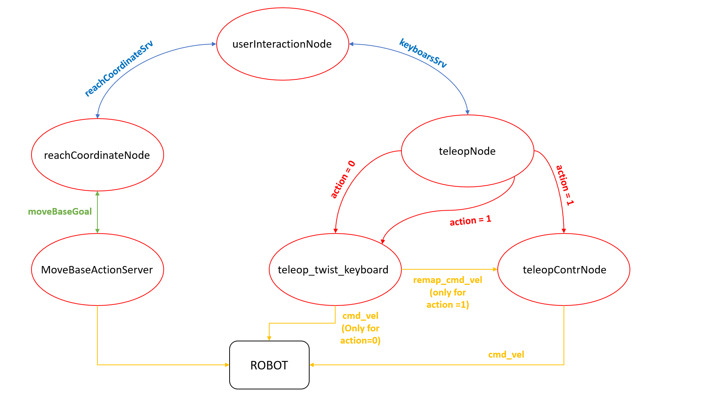
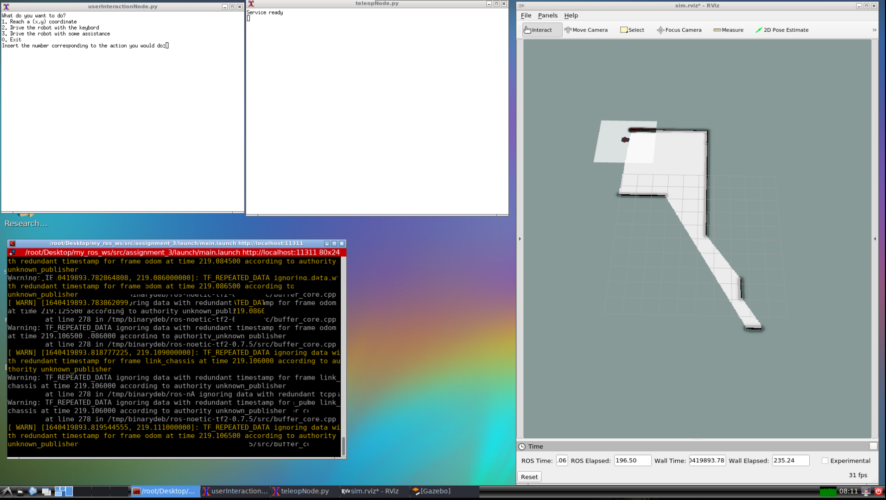

# Research Track 1: assignment n. 03
## Description of the assigment
In this assignment we have to develop a software architecture for the control of the robot in the environment. The sofware is rely on the move_base and gmapping packages for localizing the robot and the plan motion.
The architecture is able to get the user request, and let the robot execute one of the following behaviors:
1. Autonomously reach a x,y coordinate inserted by the user
2. Let the user drive the robot with the keyboard without any control for collision
3. Let the user drive the robot assisting them to avoid collisions

In the first case, if the user insert a target that cannot be reached the program should tell it to the user and cancel the goal.
In the third case, instead, the robot didn't go forward if there is an obsacle in the front and didn't turn left/right if there are obstacles on the left/right.

## How to install and run the code
To run the code is first necessary to install xterm with the following command:
```
sudo apt-get install xterm
```
Before start check if the .py files are executable.  
In orther to use the software run the command:
```
roslaunch final_assignment simulation_gmapping.launch
```
```
roslaunch final_assignment move_base.launch
```
```
roslaunch assignment_3 main.launch
```

## Documentation
Documentation for the code of the assignment is avaiable at this [link](https://dariaberretta.github.io/assignment_03/)


## Workflow of the code
The main node of this software is the 'userInteractionNode'. Through it the user chooses which of the three actions performs.
The 'userInteractionNode' implements two different client to two different service.  
When the user decides to performes the action 1 (autonomously reach a x,y coordinate) the node create a client for the 'reachCoordinateService'
```
float64 x
float64 y
---
int32 ret
```
The server for this service is implemented in the 'reachCoordinateNode', which with the use of a simple action client to the 'MoveBaseAction' make a goal request with the coordinates recived by the 'reachCoordinateService'.  
If the goal is reached within a time limit the service's return is set to 1, instead if the goal is not reached the return is set to 0.  
This value, then, is read in the 'userInteractionNode' to inform the user if the position have been reached or not.

Instead, when the user decides to call action 2 or action 3, the node create a client to the 'keyboardService' with two different values for the parameter 'action': 
```
int32 action
---
int32 return
```
If the value of the parameter is set to 0, the 'teleopeNode' which implement the server for the 'keyboardService' calls the 'teleop_twist_keyboard' node. This node allows the user to navigate the robot via keyboard, as desired.  
On the contrary if the parameter is set to 1, the 'teleopeNode' calls the 'option3' launch file:
```xml
<?xml version="1.0"?>

<launch>
    <node name="option3" pkg="assignment_3" type="teleopContrNode.py"/>
    <remap from="cmd_vel" to="remap_cmd_vel" />

    <node name="teleop_twist_keyboard" pkg="teleop_twist_keyboard" type="teleop_twist_keyboard.py" output="screen" />

</launch>
```
As you can see, within the launch file the topic 'cmd_vel' is remap to another topic 'remap_cmd_vel'.  
In this way, inside the 'teleopContrNode' node that is called, it is possible to execute some instructions to prevent the robot from colliding with the walls, partially overwriting the commands requested by the user.



## Details
To achieve the movement of the robot in the first and second cases, it was mainly necessary to implement two services.  
In the first case, however, a simple action client was also used. It sends a goal to the action server implemented by the 'move_base' package.  
In the second case it was only necessary to call the node 'teleop_twist_keyboard' which allows the user to navigate the robot by posting on the topic 'cmd_vel'.  
The most particular case was the implementation of the third point. In fact, it was necessary to create a node to control the movements of the robot, to prevent it from hitting the walls, and it was also necessary to remap the topic 'cmd_val' used by the node 'teleop_twist_keyboard', to topic 'remap_cmd_vel'.  
To avoid the walls, the robot's 180 ° field of view was used, divided into three different sections and monitored the minimum distance of the robot from the walls for each section.  
If a distance of one of the three sections is too small, the robot is not allowed to proceed in that direction.

## Idications
The software user interface is as follows:

To select an action, the user must enter the corresponding number in the shell named 'userInterfaceNode'.  
When the user selects action 2 or action 3, "the command" switches to the shell named teleopeNode.  
If the user has selected option 2, and has finished his action, to return to the selection menu he must press the 'Crtl + C' command once.  
If the user has selected option 3, to return to the selection menu he will must press the command 'Ctrl + C' twice, once to exit to the 'teleope_twist_keyboard', and once to exit to the 'teleopContrNode'.  
To exit the selection menu, press the '0' key.  
To permanently close the program, you need to close the main shell.

## 
**Authors:** Daria Berretta
